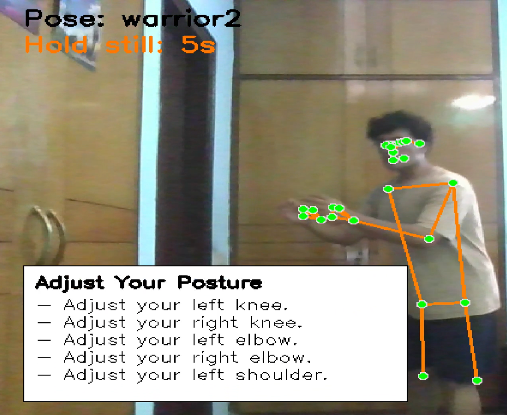
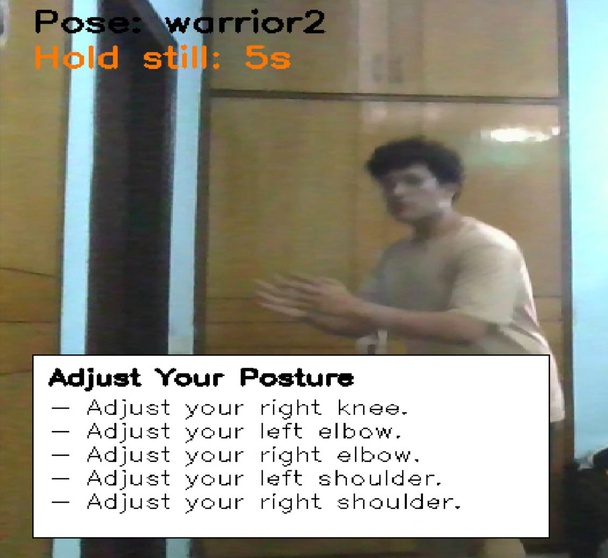

# Posture-Check: Yoga Pose Correction System

Posture-Check is a real-time yoga posture analysis tool built using computer vision techniques. It uses MediaPipe to extract body landmarks and compares the user's posture with predefined reference angles to provide corrective feedback.

## Features

- Real-time webcam-based posture detection
- Pose validation against reference angles
- Visual feedback and corrective tips for alignment
- Countdown timer and progress bar for holding poses
- Modular structure for easy expansion and maintenance

## Technologies Used

- Python 3
- OpenCV
- MediaPipe
- NumPy
- JSON for structured reference data

## Project Structure

YogaPostureCorrection/
├── angles.json # Reference joint angles for each yoga pose
├── analysis.py # Real-time pose validation and feedback script
├── extraction.py # Extracts joint angles from dataset to build angles.json
├── Dataset/ # Folder containing reference media for poses
├── README.md # Project documentation

## Workflow

1. `extraction.py` reads pose data from the dataset and generates `angles.json`.
2. `analysis.py` starts the webcam, allows the user to choose a pose, and validates it in real time.
3. Users receive real-time posture correction tips if alignment is incorrect.
4. Holding the correct pose for 5 seconds triggers success feedback.

## Required libraries
install opencv-python, mediapipe & numpy

## Run python analysis.py

## Future Enahancement
- Add additional yoga poses and improve angle data coverage
- Store analytics or performance history per session
- Integrate voice guidance or scoring system
- Add a web-based interface for accessibility

## Result 
Grid Lines Example 

The user is given the choice to allow grid lines or not 

No Grid Lines Example

